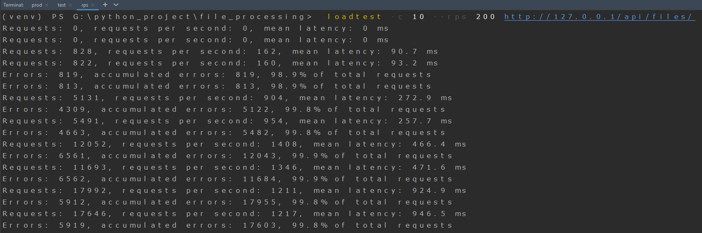
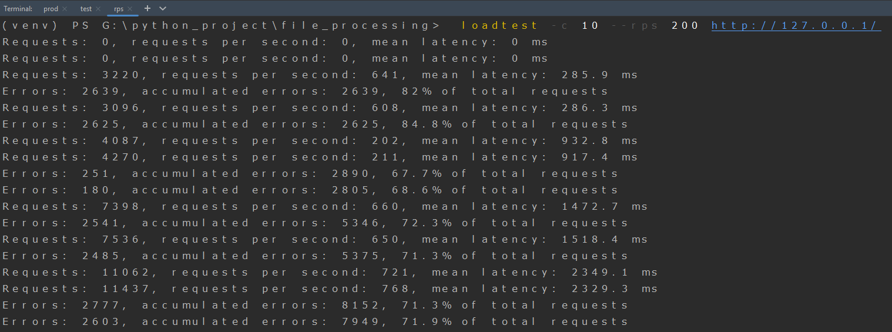

# File processing
 
 
 
 
 
 
 
 
 
 

## Description

Проект реализует функционал загрузки файлов на сервер и обработки файлов по 
средствам celery 
Для повышения производительности подключен nginx и gunicorn с несколькими 
рабочими (2 * количество ядер + 1) 
Существует два docker-compose для запуска проекта и тестов

### Запуск проекта
1. Создать папку pg_data для базы данных
2. Ввести команду в корневой папке проекта
~~~
docker-compose -f ./docker/file_processing_production/docker-compose.yaml --env-file .env up
~~~

### Запуск тестов
1. Ввести команду в корневой папке проекта
~~~
docker-compose -f ./docker/file_processing_tests/docker-compose.yaml --env-file .env up --abort-on-container-exit
~~~

### Requests per second

~~~
loadtest -c 10 --rps 200 http://127.0.0.1/api/files/
~~~

~~~
loadtest -c 10 --rps 200 http://127.0.0.1/
~~~

### Оптимизация 

1. Использовать пакетные вставки в базу, чтобы снизить число подключений
2. Добавить кэширование
3. Линейно масштабировать приложение
